# Enterprise Continuous Configuration & Fleet Automation Pipeline


**Author:** Imon Mahmud. 
IT SPECIALIST | CLOUD INFRASTRUCTURE & AI AUTOMATION ENGINEER

## Executive Summary
This repository contains the Infrastructure as Code (IaC) and automation scripts for an enterprise-grade Continuous Configuration platform. Leveraging AWS Systems Manager (SSM) and Terraform, this project provisions a strictly isolated EC2 fleet that adheres to a rigorous **Zero Trust Architecture**. The entire platform was designed, deployed, validated, and documented autonomously.

## Business Problem
Enterprise environments require strict compliance, zero public exposure, and continuous enforcement of configuration states across thousands of virtual machines. Traditional SSH-based management and public bastion hosts introduce significant security vectors and operational overhead.

## Solution
A fully automated, agent-based architecture where instances pull configuration from AWS Systems Manager.
- **No Inbound Network Access:** Security Groups have zero ingress rules.
- **No SSH or Bastion Hosts:** All terminal access and configuration happen securely via SSM Session Manager and Run Command.
- **Continuous Compliance:** SSM State Manager enforces the desired state (e.g., Nginx, CloudWatch Agent) automatically.

## Technology Stack
- **Provisioning:** Terraform (Modular Architecture)
- **Cloud Provider:** Amazon Web Services (AWS - eu-central-1)
- **Configuration Management:** AWS Systems Manager (SSM Parameter Store, Documents, State Manager)
- **Compute:** Amazon EC2 (AL2023)
- **Networking:** VPC, Private Subnets, VPC Interface & Gateway Endpoints

## Architecture Diagram
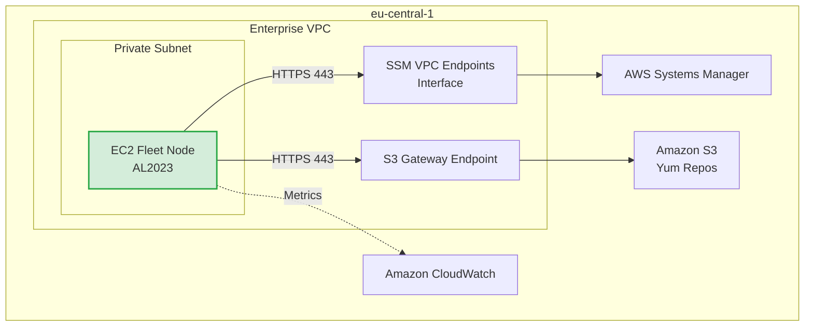

## Repository Structure
```text
├── .gitignore
├── README.md
├── SECURITY_AUDIT_REPORT.md
├── documents/
│   ├── install_cw_agent.yaml
│   └── install_nginx.yaml
├── scripts/
│   ├── verify_fleet.ps1
│   └── verify_fleet.sh
├── screenshots/
└── terraform/
    ├── main.tf
    ├── outputs.tf
    ├── providers.tf
    ├── variables.tf
    └── modules/
        ├── ec2/
        ├── iam/
        ├── ssm/
        └── vpc/
```

## Security Architecture & Zero Trust Design
1. **Private Subnets Only:** Resources are completely hidden from the public internet.
2. **Egress-Only Security Groups:** EC2 instances cannot accept any inbound connections, strictly enforcing a pull-based management model.
3. **VPC Endpoints (AWS PrivateLink):** Traffic to AWS Services (SSM, S3) never traverses the public internet.
4. **IAM Instance Profiles:** Least privilege policies (`AmazonSSMManagedInstanceCore`, `CloudWatchAgentServerPolicy`) are attached instead of long-lived access keys.

## Configuration Management Workflow
1. **SSM Parameter Store** securely holds configuration values and environmental metadata.
2. **SSM Documents** define the exact shell scripts required to install dependencies.
3. **SSM State Manager** runs associations on a schedule or instance boot, guaranteeing the node converges to the desired state without manual intervention.

## Validation & Testing
The `scripts/verify_fleet.ps1` runs post-deployment to ensure:
- Instance registers as `Online` in Systems Manager.
- State Manager Associations complete with `Success`.
- Nginx service is verified as running via SSM `AWS-RunShellScript`.

## Cost Optimization
- Eliminated NAT Gateways (saving ~$32/month) by utilizing S3 Gateway Endpoints (Free) and SSM Interface Endpoints, significantly reducing idle network costs while maintaining extreme security.

---

## Screenshot Gallery

### 1. Zero Trust EC2 & Networking
The instance runs entirely in a private subnet with no public IP and egress-only security rules.
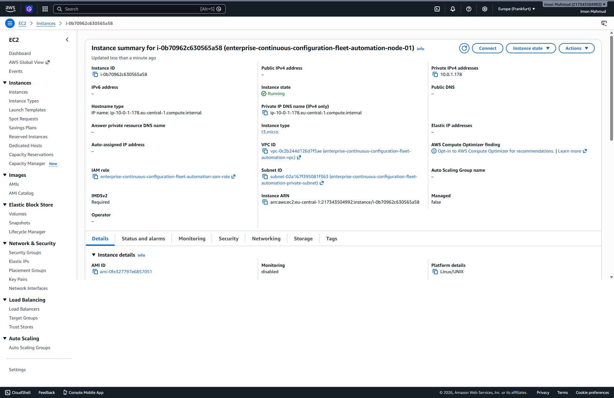
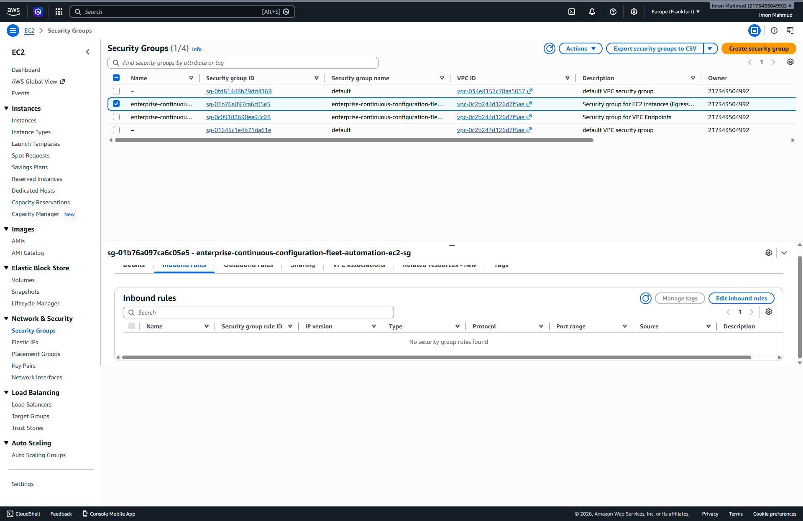
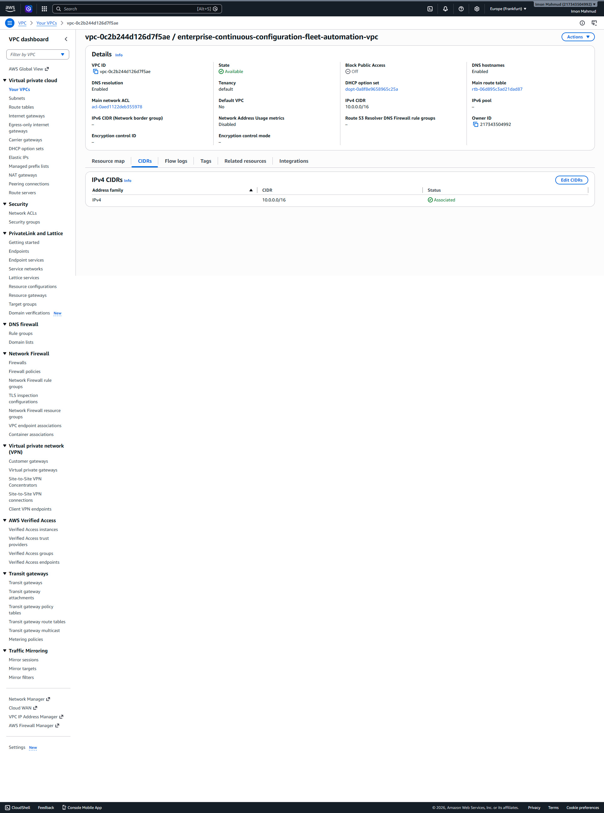
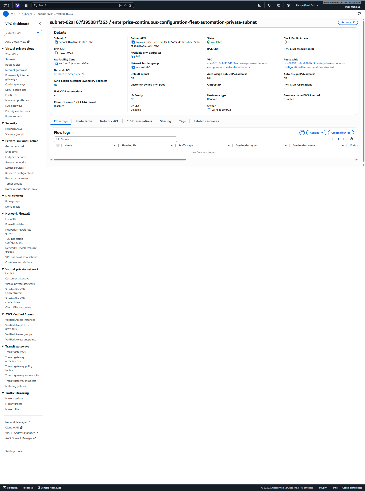

### 2. Systems Manager Fleet Automation
AWS Systems Manager maintains total control over the private instance, managing configurations and states.
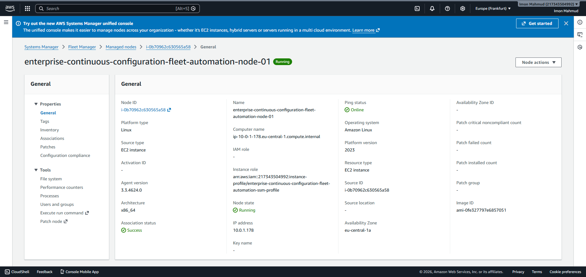
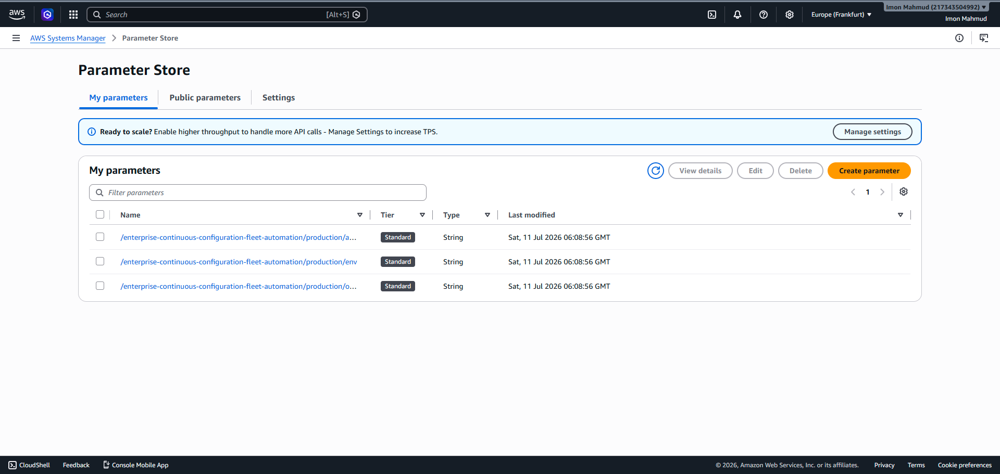
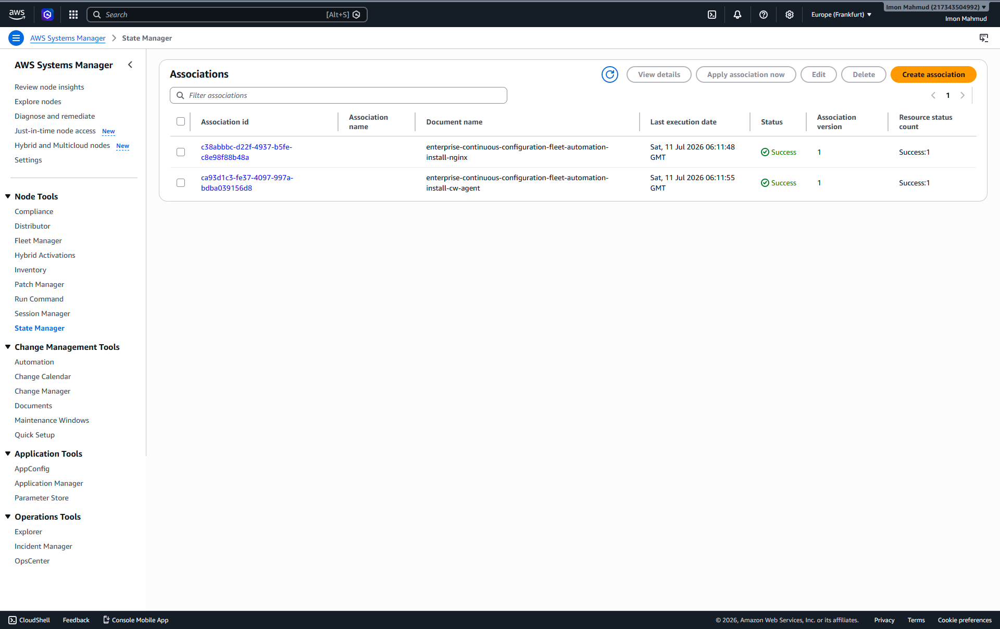

### 3. Additional AWS Components
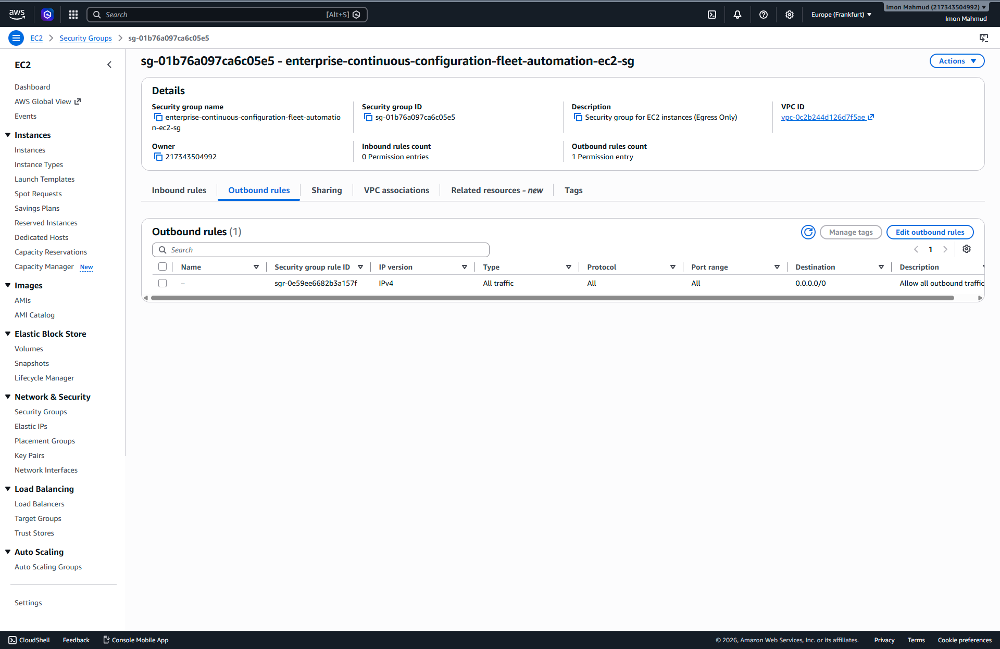

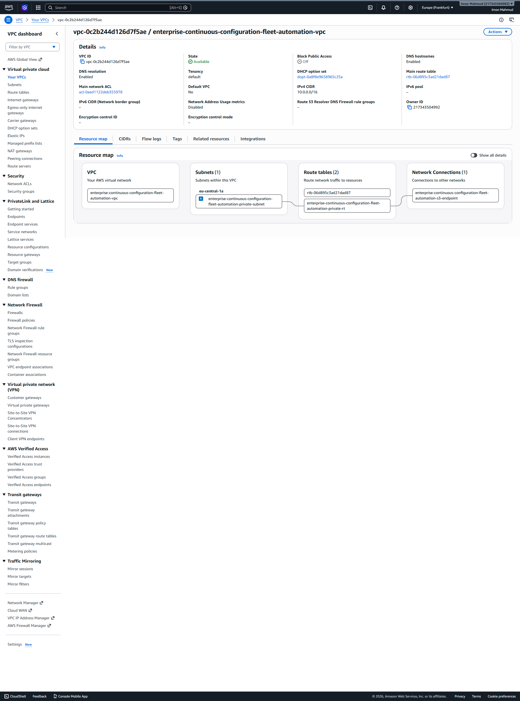
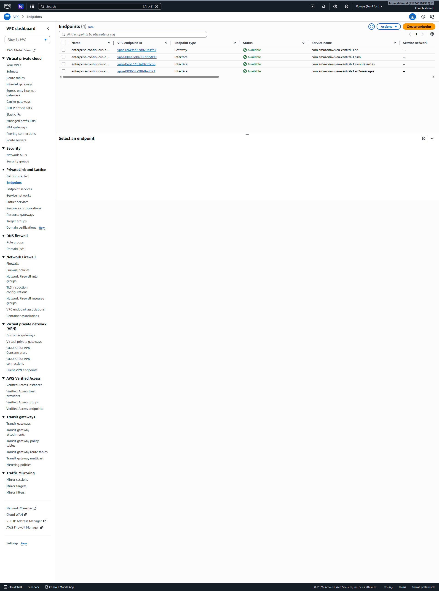

## Conclusion
This implementation proves the viability of highly secure, scalable, and fully automated cloud infrastructures. The architecture removes human-error vectors (like exposed SSH ports) and guarantees infrastructural compliance natively within AWS.
